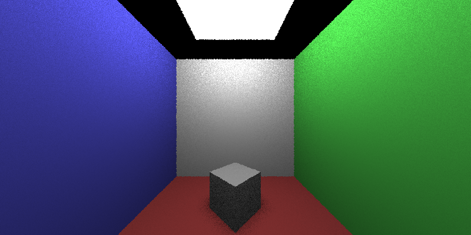
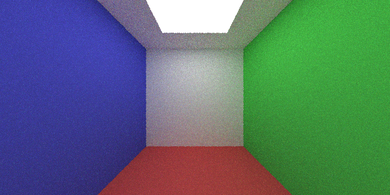
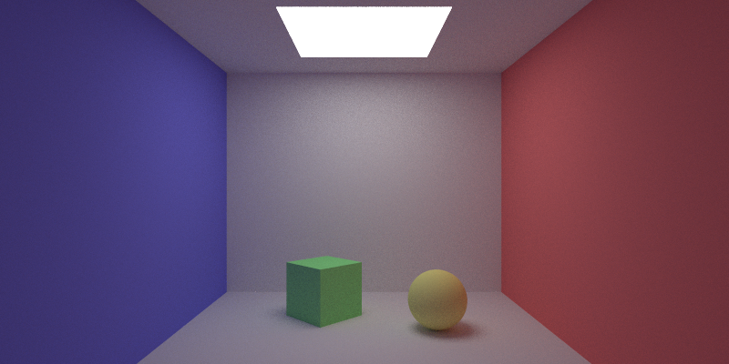
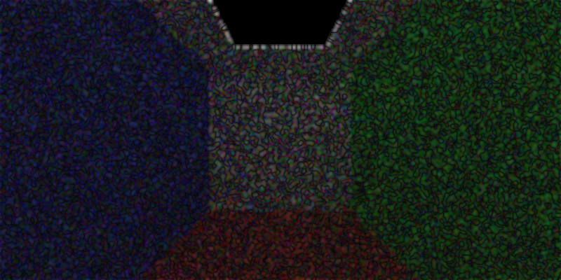

# Bidirectional Path Tracing Renderer  
_C++17 / CMake / stb_image_write / OpenMP


> レイトレーシング → コサイン加重パストレーシング → Next Event Estimation → **双方向パストレーシング (BDPT)**  
> へとステップアップしながら、**BRDF 重要度サンプリング** と **Power-Heuristic MIS** を実装中。  
> “理論上の正解画像との差分がモンテカルロノイズのみ” をゴールに、独自の **差分解析パイプライン** で数値検証を行っています。  

---

## 目次
1. [概要](#概要)  
2. [ディレクトリ構成](#ディレクトリ)  
3. [ビルド & 実行](#ビルド)   
4. [レンダリング画像](#画像) 
5. [検証フロー](#検証)  
6. [今後のロードマップ](#今後) 
7. [OpenMPの使用] 
8. [参考文献](#参考文献)  
9. [ライセンス](#ライセンス)  

---

## 概要<a name="概要"></a>
長方形と球体の衝突判定を行うレンダリングをレイトレーシング → パストレーシング → NEEにて実装。また、それらを多重重点的サンプリングにて組み合わせたBDPT(双方向パストレーシング)の実装を進めている。

## ディレクトリ構成<a name="ディレクトリ"></a>

```
Renderer/
├─ include/             # ヘッダ (Vec3, Ray, BRDF, Object, …)
├─ src/                 # 実装 (BDPTRender, PathGenerator, …)
├─ diff/                # レンダリング結果の期待値検証
├─ docs/
│   └─ images/          # README 用スクリーンショット
├─ CMakeLists.txt
└─ README.md
```

## ビルド＆実行方法<a name="ビルド"></a>

### 依存ライブラリ
C++17 対応コンパイラ（例: g++-13, clang-18, MSVC 19.3+）
CMake ≥ 3.16
stb_image_write(ヘッダのみ)

git clone https://github.com/your-id/Renderer.git

cd Renderer

### CMake ビルド
mkdir build
cd build
cmake ..
cmake --build .

### レイトレーシングでレンダリング
./build/raytracing             # 出力 → results/rt.pfm

### コサインウェイトサンプリングを用いたパストレーシングでレンダリング
./build/cosweight              # 出力 → results/cos.pfm

### NEEを用いたパストレーシングでレンダリング
./build/NEE                    # 出力 → results/nee.pfm

### BDPTでレンダリング(実装中)
./build/bdpt                   # 出力 → results/bdpt.pfm

### BDPT でパス長毎にレンダリング
./build/comparePT              # 出力 → compare/length_*/

### pfmファイルをpngファイルに変換
./pfm2png [input.pfm] [output.png]

### レンダリング結果の比較(pfm)
./diff [a.pfm] [b.pfm] [gaussian_sigma] [output.pfm]

### レンダリング結果の比較(png)
cd ../diff
./setup.sh                     # 仮想環境構築
source venv/bin/activate       # 仮想環境有効化
python3 diff.py                # BDPTとリファレンスレンダラ(コサインウェイトサンプリングPT)の比較画像生成
deactivate                     # 仮想環境終了


## レンダリング画像<a name="画像"></a>

| ファイル | 内容 |
| :-- | :-- |
|  | レイトレーシングの結果 |
|  | コサインウェイトサンプリングによるパストレーシングの結果 |
|  | NEEを用いたパストレーシングの結果 |
|  | 双方向パストレーシングの結果 |
|  | `compare.cpp` による差分ヒートマップ |

## 検証フロー<a name="検証"></a>
同一シーンかつ同一のパス長においては、理論上すべてのレンダリング手法が導き出す放射輝度の期待値は一致するはずです。したがって、レンダリング結果同士の差分画像は理想的には**完全な白（差分ゼロ）**となります。

しかし実際には、モンテカルロ積分に伴うランダムノイズにより、両者の出力にはばらつきが生じます。どちらの画像に正の揺らぎ、負の揺らぎが現れるかはランダムであり、これらの差はピクセル単位で局所的に分布します。

この確率的誤差を視覚的に捉えるために、差分画像にガウシアンフィルタを適用し絶対値を取ることで、ランダムな黒い波線が浮かび上がります。これは「期待値は一致しているが、サンプル数が有限であるために生じた自然な揺らぎ」を示しており、実装の物理的正しさを視覚的に検証する強力な手段となります。


## 今後のロードマップ<a name="今後"></a>
完全なBDPTの実装


## OpenMPの使用
依存関係と OpenMP の導入 

1. Homebrew で LLVM & LibOMP をインストール

brew install llvm libomp

2. シェル設定 (~/.zshrc) にパスを通す

# --- OpenMP 用 ---
export PATH="/opt/homebrew/opt/llvm/bin:$PATH"      # clang++, clang, lld など
export LDFLAGS="-L/opt/homebrew/opt/libomp/lib"     # ランタイムを探す
export CPPFLAGS="-I/opt/homebrew/opt/libomp/include"# ヘッダを探す

設定後に反映:
source ~/.zshrc
which clang++   # /opt/homebrew/opt/llvm/bin/clang++ が出れば OK


## 参考文献<a name="参考文献"></a>
| 著者               | タイトル                                                        | 備考           |
| ---------------- | ----------------------------------------------------------- | --------------    |
| Veach, E.        | *Robust Monte Carlo Methods for Light Transport Simulation* | BDPT & MIS の基礎  |
| Pharr, M. et al. | *Physically Based Rendering, 4th Ed.*                       | 実装指針全般        |
| Christophe H.    | *The Veach-style BDPT Explained*                            | PDF 変換解説       |


## ライセンス<a name="ライセンス"></a>